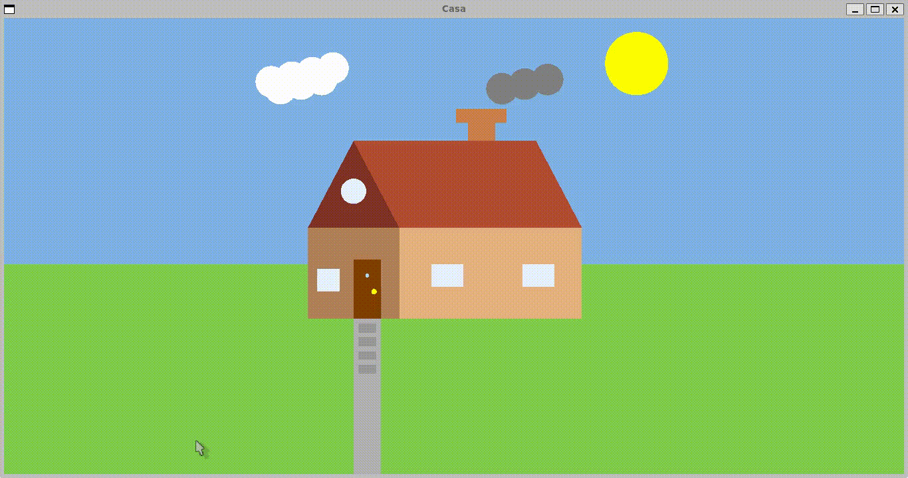
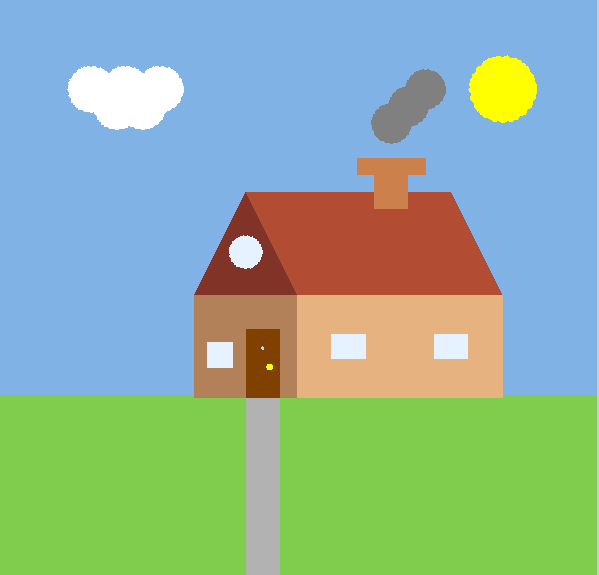

# Computacao-Grafica
Repositório da matéria de Computação Gráfica

---
&nbsp;

## 🧱 Versão 2 

## 🏠 Descrição do projeto
Este projeto representa a modelagem de uma casa estilizada utilizando OpenGL em modo 2D com projeção ortogonal, desenvolvido como parte da disciplina de Computação Gráfica. A cena contempla diversos elementos geométricos para compor uma paisagem harmoniosa e detalhada, incluindo:
Casa com telhado, chaminé, porta e janelas;
Sol e céu azul ao fundo;
Grama preenchendo toda a base da janela, adaptável ao redimensionamento da tela;
Caminho de pedras até a porta da casa, utilizando repetição de primitivas (laços for);
Uso de formas geométricas básicas (retângulos, triângulos, círculos) para construção dos elementos;
Aplicação de cores suaves e contrastantes para destacar as partes da casa;
Projeção ortogonal com tratamento de proporção na função de redimensionamento (glOrtho com aspect ratio);
Estruturação do código com organização das funções de inicialização, desenho e redimensionamento.
Este trabalho demonstra a aplicação prática de conceitos fundamentais da Computação Gráfica, como transformações, cores, buffers e renderização em tempo real usando a biblioteca OpenGL com GLUT.